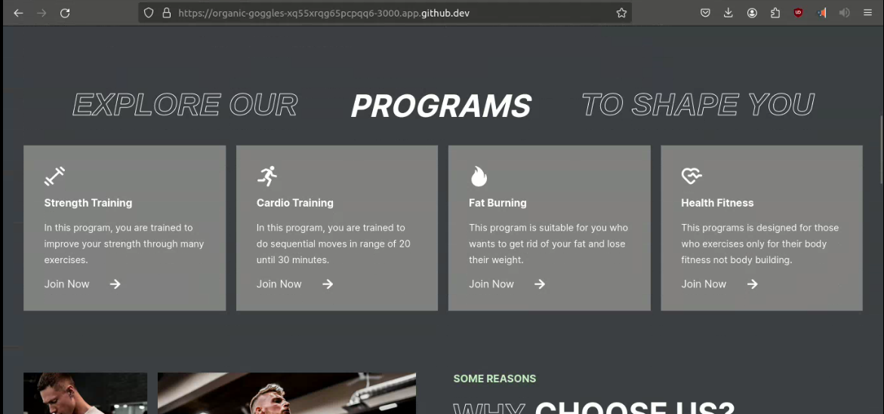

# HFITNESS


## Introduction
Welcome to HFITNESS, a platform designed to empower coaches to offer personalized diet plans and exercise routines to their clients while efficiently tracking their health progress. With a user-friendly interface and robust backend, HFITNESS streamlines the process of coaching and monitoring health goals.

- **Deployed Site:** [HFITNESS.me](https://your-deployed-site.com) => (will be deployed soon)
- **Final Project Blog Article:** [HFITNESS Blog](https://your-blog-article-link.com) => (blog writing in progress)
- **Author(s) LinkedIn:** [Ayoub Zakarya](https://www.linkedin.com/in/ayb-zakarya/) - [Layla Abkari](https://www.linkedin.com/in/layla-abkari-5505301a3/)


## Technologies
HFITNESS utilizes the following technologies:

- **Frontend:**
  - React
  - HTML
  - CSS

- **Backend:**
  - PostgreSQL
  - Express

- **Authentication:**
  - JWT (JSON Web Tokens)
  - Auth0 (for user authentication and authorization)

## Installation
To get started with HFITNESS, follow these steps:

1. Clone the repository from GitHub:

    ```bash
    git clone https://github.com/aybzakaria5/Hfitness.me.git
    ```

2. Navigate to the project directory:

    ```bash
    cd Hfitness.me
    ```

3. Install dependencies for both the frontend and backend:

    ```bash
    cd frontend
    npm install
    cd ../backend
    npm install
    ```

4. Set up environment variables:
    - Create a `.env` file in the `backend` directory.
    - Define necessary environment variables like database connection string, API keys, etc.

5. Start the frontend and backend servers:

    ```bash
    cd ../frontend
    npm start
    cd ../backend
    npm start
    ```

6. Access HFITNESS in your browser at `http://localhost:3000`.

## Usage
HFITNESS offers a seamless experience for both coaches and clients:

- Coaches can:
  - Create personalized diet plans and exercise routines.
  - 

  - Track clients' health progress.
   - 

  - Communicate with clients through the platform.
- Clients can:
  - Access their personalized diet plans and exercise routines.
   - 

  - Track their health progress over time.
  - Communicate with their coach.
    - 

## Contributing
We welcome contributions from the community to improve HFITNESS. To contribute:

1. Fork the repository.
2. Create your feature branch (`git checkout -b feature/YourFeature`).
3. Commit your changes (`git commit -am 'Add some feature'`).
4. Push to the branch (`git push origin feature/YourFeature`).
5. Open a pull request.

Please ensure your code follows the project's coding style and conventions.

## Related Projects
Check out these related projects:
- [Fitness Tracker App](https://github.com/example/fitness-tracker): An alternative fitness tracking application.

## Licensing
This project is licensed under the MIT License - see the [LICENSE](https://github.com/aybzakaria5/Hfitness.me/blob/main/LICENSE) file for details.
